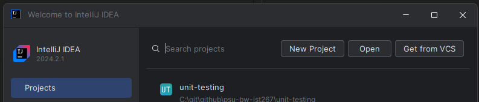
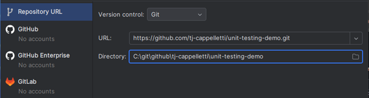

# IntelliJ
1. Launch IntelliJ and if presented with an existing workspace, click "File -> Close Project"
2. Click "Get from VCS" 

3. Specify the directory you wish to clone the repository too. Ensure the directory is a location that you can easily access. I recommend using the `C:\git\github\[your-github-handle]`
    - `git` - Indicates that the directory contains Git repositories
    - `github` - Indicates that the repositories came from GitHub
    - `[your-github-handle]` - Indicates who the owner of the repository is on GitHub 

    You do not have to follow this structure, just make sure it’s a path you know in case you have to use the Git CLI and need to navigate to the directory
4. Enter your repository URL which should be `https://github.com/your-gh-handle/unit-testing-demo.git`.
    - Entering the URL after you set the directory ensures IntelliJ that it uses the repository name in the folder.
5. Double check the value you want for `Directory` is correct. 

6. If everything looks good, click "Clone". You may get prompted to trust the project/repository. Since this is your repository, you should trust it.
    - Rf you trust the parent folder and follow my structure guideline, you won’t get prompted again for any repository you own.
    - You may get prompted to authenticate against GitHub, follow [GitHub authentication](https://docs.github.com/en/authentication) instructions
7. You now have a new folder at the root of the repository called `.idea`. This is IntelliJ’s configuration and you should immediately commit this immediately. 
   