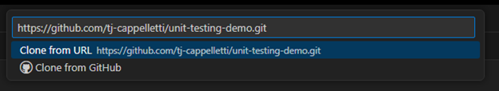
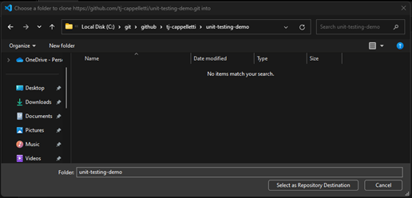
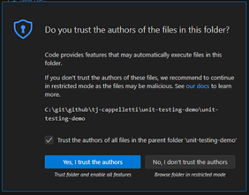

# Visual Studio Code
1.	Launch Visual Studio Code
    - If an existing folder is opened, click "File -> Close folder"
2.	Click "Clone Git Repository" 
    
 
3.	This will open the command palette in Visual Studio Code and prompt you for a GitHub URL. Enter the URL for your repository and hit "Enter" or click "Clone from URL" 
    
 
4.	This will bring up the folder dialog where you can select a folder. Ensure the directory is a location that you can easily access. I recommend using the `C:\git\github\[your-github-handle]`
    - `git` - Indicates that the directory contains Git repositories
    - `github` - Indicates that the repositories came from GitHub
    - `[your-github-handle]` - Indicates who the owner of the repository is on GitHub 

    

    You do not have to follow this structure, just make sure it’s a path you know in case you have to use the Git CLI and need to navigate to the directory
 
5.	Once you have the folder location you want, click "Select as Repository Destination". You may get prompted to authenticate against GitHub, follow GitHub authentication instructions.
6.	You will be prompted to open the cloned repository, click "Open". You may get prompted to trust the project/repository. Since this is your repository, you should trust it. Also worth noting that if you trust the parent folder and follow my structure guideline, you won’t get prompted again for any repository you own.  
